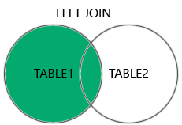

## SQL JOIN

En mis palabras:
Son conectores de tablas para extraer info de las dos tablas y agregarlas a una nueva tabla para ser retornada.  
Los JOIN principales son:

1. INNER JOIN  
   <picture>
   
   </picture>

2. LEFT JOIN  
   <picture>
   
   </picture>

3. RIGHT JOIN  
   <picture>
   
   </picture>
4. FULL OUTER JOIN  
   <picture>
   
   </picture>

## INNER JOIN

Para ejemplificar INNER JOIN utilizaremos dos tablas, estas son un fragmento de cada una para referencia:

### Tabla customers:

| CustomerID | CustomerName                        | ContactName    | Address                       | City       | PostalCode | Country |
| ---------- | ----------------------------------- | -------------- | ----------------------------- | ---------- | ---------- | ------- |
| 1          | Alfreds Futterkiste                 | Maria Anders   | Obere Str. 57                 | Berlin     | 12209      | Germany |
| 2          | Ana trumilllo Emparedados y helados | Ana Trujillo   | Avda. de la Constitución 2222 | Mexico D.F | 05021      | Mexico  |
| 3          | Antonio MorenoTaqueia               | Antonio Moreno | Matadores 2312                | Mexico D.F | 05023      | Mexico  |
| 4          | Around the Horn                     | Thomas Hardy   | 120 Hanover Sq.               | London     | Wa1 1DP    | UK      |

### Tabla orders:

| OrderID | CustomerID | OrderDate  |
| ------- | ---------- | ---------- |
| 10308   | 2          | 1996-09-18 |
| 10309   | 37         | 1996-09-19 |
| 10310   | 77         | 1996-09-20 |

La columna CutomerID es la columna en comun de las dos tablas, por lo que podemos aplicar JOIN en estas dos tablas.

##

La idea es la siguiente  
<picture>

</picture>

INNER JOIN retorna la informacion a escojer de los documentos que coinsidan en una columna en comun:

```sql
SELECT Orders.OrderID, Customers.CustomerName, Orders.OrderDate
FROM Orders
INNER JOIN Customers ON Orders.CustomerID=Customers.CustomerID;
```

output:

| OrderID | CustomerName                       | OrderDate  |
| ------- | ---------------------------------- | ---------- |
| 10308   | Ana Trujillo Emparedados y helados | 9/18/1996  |
| 10365   | Antonio Moreno Taquería            | 11/27/1996 |
| 10383   | Around the Horn                    | 12/16/1996 |
